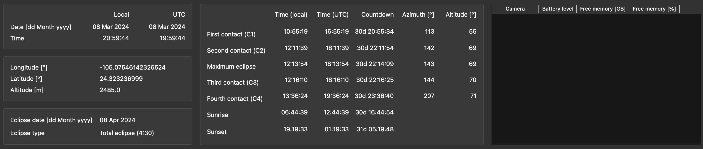
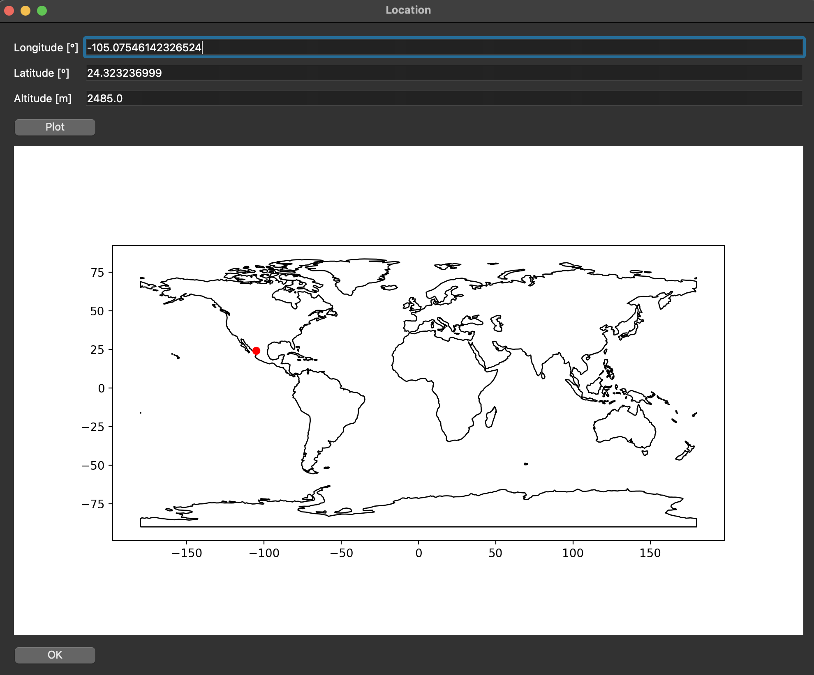
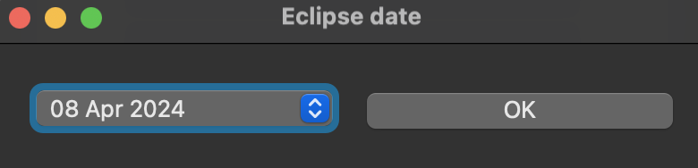
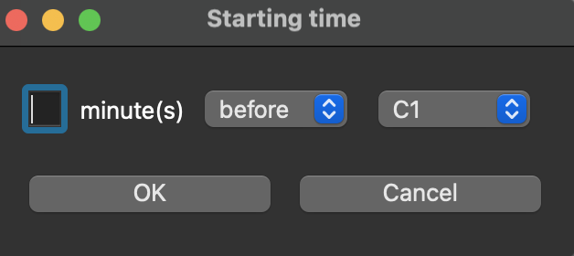
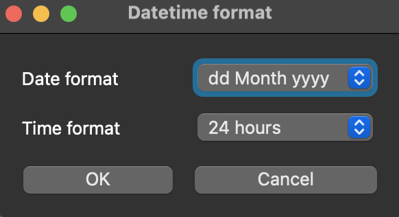

# Solar Eclipse Workbench


## Table of contents

[//]: # (- [Solar Eclipse Workbench]&#40;#solar-eclipse-workbench&#41;)
[//]: # (  - [Table of contents]&#40;#table-of-contents&#41;)
- [Solar Eclipse Workbench](#solar-eclipse-workbench)
  - [Table of contents](#table-of-contents)
  - [Installation instructions](#installation-instructions)
    - [Installation on macOS](#installation-on-macos)
    - [Installation on Ubuntu 24.04](#installation-on-ubuntu-2404)
    - [Installation on Windows 11](#installation-on-windows-11)
  - [Upgrading Solar Eclipse Workbench](#upgrading-solar-eclipse-workbench)
  - [Running Solar Eclipse Workbench](#running-solar-eclipse-workbench)
    - [Command line parameters](#command-line-parameters)
    - [UI functionality](#ui-functionality)
      - [Observing location](#observing-location)
      - [Eclipse date](#eclipse-date)
      - [Reference moments](#reference-moments)
      - [Camera overview](#camera-overview)
      - [Simulation mode](#simulation-mode)
      - [Job scheduling](#job-scheduling)
      - [Interrupting scheduled jobs](#interrupting-scheduled-jobs)
      - [Datetime format](#datetime-format)
      - [Saving settings](#saving-settings)
  - [Running the Configuration Wizard](#running-the-configuration-wizard)
  - [Using two cameras of the same model, or one camera with multiple setups](#using-two-cameras-of-the-same-model-or-one-camera-with-multiple-setups)
  - [Script file format](#script-file-format)
    - [General remarks](#general-remarks)
    - [Commands](#commands)
  - [Shortcomings](#shortcomings)
  - [Converting scripts from Solar Eclipse Maestro](#converting-scripts-from-solar-eclipse-maestro)
  - [Error handling](#error-handling)
  - [Development Guide](#development-guide)
    - [Installation on macOS](#installation-on-macos-1)
    - [Installation on Ubuntu 24.04](#installation-on-ubuntu-2404-1)
    - [Installation on Windows 11](#installation-on-windows-11-1)
  - [Create and upload a new pip package](#create-and-upload-a-new-pip-package)
  - [License](#license)
  - [Changelog](#changelog)
  - [Image attributions](#image-attributions)
    - [GUI icons](#gui-icons)

## Installation instructions

### Installation on macOS

- Create a new python environment.  You can use venv or any python environment manager for this (like anaconda, micromamba, ...)

```bash
python -m venv solareclipseworkbench
source solareclipseworkbench/bin/activate
```

- For modern Apple Mac computers (using Apple Silicon processors), install [homebrew](https://brew.sh/). Add your homebrew/bin directory to your PATH. Then install gphoto2 and GDAL (required by geopandas) using homebrew:

```bash
export PATH=<location_of_homebrew_installation>/bin:$PATH
brew install gphoto2 pkg-config gdal
```

- Note: macOS normally ships with an older system Python (for example 3.9.6). Since the instructions above use Homebrew to install `gphoto2`, it's convenient to also install a newer Python via Homebrew and create the virtual environment with that. Solar Eclipse Workbench does need python 3.11 or higher to work.  

```bash
# install Python 3.11 via Homebrew
brew install python@3.11

# create and activate the venv using the Homebrew Python
python3.11 -m venv solareclipseworkbench
source solareclipseworkbench/bin/activate
```

- Install the Solar Eclipse Workbench:

```bash
pip install solareclipseworkbench
```

### Installation on Ubuntu 24.04

- Install gstreamer to be able to play the sound notifications by executing the following line in the terminal

```bash
sudo apt-get update
sudo apt install libgstreamer1.0-dev libgstreamer-plugins-base1.0-dev libxkbcommon-x11-0 libxcb-cursor0 libcairo2-dev python3.12-venv
```

- Install gphoto2 to be able to access the cameras by executing the following line in the terminal

```bash
sudo apt-get install gphoto2 libgphoto2-dev python3-gphoto2
```

- Make sure that gvfs is not started automatically

```bash
sudo chmod -x /usr/lib/gvfs/gvfs-gphoto2-volume-monitor
sudo chmod -x /usr/lib/gvfs/gvfsd-gphoto2
```

- Install `gdal-config`, required by `geopandas` (especially on Raspberry Pi):

```bash
sudo apt install libgdal-dev gdal-bin
```

- Create a new python environment.  You can use venv or any python environment manager for this (like anaconda, micromamba, ...)

```bash
python3 -m venv solareclipseworkbench
source solareclipseworkbench/bin/activate
```

- Install the Solar Eclipse Workbench:

```bash
pip install solareclipseworkbench
```

### Installation on Windows 11

- GPhoto2 is only available for Linux and macOS.  To run Solar Eclipse Workbench, wsl should be used.
- Open a terminal or powershell in Windows
- Install wsl by executing the command

```bash
wsl --install
```

- Reboot your computer
- Install Ubuntu 24.04 in wsl, buy opening a new terminal or powershell and executing the following command:

```bash
wsl.exe --install Ubuntu-24.04
```

- If you see any errors, make sure to check them.  One of the possible problems is that virtualization is not enabled in the BIOS.  It is important to enable this.
  
- Start using wsl by typing `wsl` in a new terminal.

- Install gstreamer to be able to play the sound notifications by executing the following line in the terminal

```bash
sudo apt-get update
sudo apt install libgstreamer1.0-dev libgstreamer-plugins-base1.0-dev libxkbcommon-x11-0 libxcb-cursor0 libcairo2-dev python3.12-venv
```

- Install gphoto2 to be able to access the cameras by executing the following line in the terminal

```bash
sudo apt-get install gphoto2/noble libgphoto2 python3-gphoto2
```

- Create a new python environment.  You can use venv or any python environment manager for this (like anaconda, micromamba, ...)

```bash
python -m venv solareclipseworkbench
```

- Eventually, to make the sound notifications a bit faster, install pygobject:

```bash
sudo apt install libcairo2-dev libgirepository1.0-dev gcc python3-dev gobject-* gir1.2-*
pip install pygobject
```

- Install the Solar Eclipse Workbench:

```bash
pip install solareclipseworkbench
```

### Make cameras accessible in wsl

The USB devices are not automatically accessible in wsl.  To make the cameras accessible, the following steps should be taken:
- Download the usbipd-win package from [GitHub](https://github.com/dorssel/usbipd-win/releases)
- Install the package
- Start a PowerShell terminal as administrator
- Connect the cameras to the computer
- Execute the following command in the PowerShell terminal

```bash
usbipd list
```

- The cameras should be listed (with their camera name or as MTP USB Device).  The camera_id is the busid of the camera.  This can be found in the list of usbipd list.  The camera_id is a number with a colon and a number (e.g. 1:2).  The command to bind the camera to wsl is

```bash
usbipd bind --busid <camera_id>
```

- Attach the camera to wsl by executing the following command in a PowerShell terminal.  Make sure that a wsl terminal is also open. **This should be done every time the camera is connected to the computer!!**

```bash
usbipd attach --wsl --busid <camera_id>
```

- The camera should now be available in wsl. You can test this by executing the following command:

```bash
lsusb
```

- The camera can not be accessed yet by the normal user.  To make this work, the user should be added to the plugdev group.  This can be done by executing the following command in the wsl terminal, and log in into :

```bash 
sudo usermod -aG plugdev $USER
```

#### Replace the Windows USB driver with WinUSB (required for gphoto2)

After attaching the camera with `usbipd`, Windows still keeps its own PTP/WIA driver active.
gphoto2 uses **libusb** and cannot claim a device that the Microsoft PTP driver already holds — this causes the error `[-53] Could not claim the USB device`.
You must replace the driver once per camera model using **Zadig**:

1. Download and run **Zadig** from [https://zadig.akeo.ie](https://zadig.akeo.ie) **on the Windows host** (not inside WSL).
2. Connect the camera and attach it to WSL with `usbipd attach --wsl --busid <busid>`.
3. In Zadig, open *Options → List All Devices* and select the camera (it may appear as "MTP USB Device" or the camera model name).
4. In the driver drop-down on the right, select **WinUSB**.
5. Click **Replace Driver** and wait for it to finish.
6. Detach and re-attach the camera so the new driver is used:

```powershell
usbipd detach --busid <busid>
usbipd attach --wsl --busid <busid>
```

You only need to do this once; the WinUSB driver persists across reboots for that USB device.

> **Sony Alpha cameras** additionally require **PC Remote** mode to be active on the camera itself before gphoto2 can communicate with it:
> Camera Menu → Network → PC Remote Settings → PC Remote → **On**
> The camera will show `(PC Control)` in its model name when correctly connected.

## Upgrading Solar Eclipse Workbench

To upgrade Solar Eclipse Workbench to the latest version, activate your Python environment and run:

```bash
source solareclipseworkbench/bin/activate
pip install --upgrade solareclipseworkbench
```

After upgrading, verify the installed version with:

```bash
pip show solareclipseworkbench
```

## Running Solar Eclipse Workbench

- Start Solar Eclipse Workbench by executing the following commands:

```bash
source solareclipseworkbench/bin/activate
sew
```

- You can add a parameters to set the needed parameters for the eclipse.  Some examples:

```bash
# On macos, start the commands with sudo
source solareclipseworkbench/bin/activate
sudo sew -d 2024-04-08 -lon -104.63525 -lat 24.01491 -alt 1877.3
sudo sew

# In Linux or using WSL on Windows, start the command without sudo
source solareclipseworkbench/bin/activate
sew -d 2024-04-08 -lon -104.63525 -lat 24.01491 -alt 1877.3
sew
```

- There is a problem with `gphoto2`.  On macOS, Solar Eclipse Workbench needs to be started with sudo rights to be able to connect to the cameras.  In Linux (or Windows using wsl), sudo should not be used.
- The first time you run Solar Eclipse Workbench, some files are downloaded from the internet.  Make sure to do this before eclipse day!

### Command line parameters

The following command line parameters can be used to start up gui.py.


| Short parameter  | Long parameter        | Description                                                                |
|------------------|-----------------------|----------------------------------------------------------------------------|
| -h               | --help                | Show the help message and exit                                             |
| -d DATE          | --date DATE           | Date of the solar eclipse (in YYYY-MM-DD format)                           |
| -lon LONGITUDE   | --longitude LONGITUDE | Longitude of the location where to watch the solar eclipse (W is negative) |
| -lat LATITUDE    | --latitude LATITUDE   | Latitude of the location where to watch the solar eclipse (N is positive)  |
| -alt ALTITUDE    | --altitude ALTITUDE   | Altitude of the location where to watch the solar eclipse (in meters)      |
| -s               | --sim                 | Start the application in simulation mode                                   |
| --virtual-camera | --virtual-camera      | Use a virtual camera.  Only for simulation mode!                           |

### UI functionality

In the images below, a screenshot of the toolbar and the upper part of the UI are shown.


The icons on the UI toolbar must be clicked from left to right (and the required data must be provided, if applicable) in order for the values in the upper section of the UI to appear.  Alternatively, the data can be passed as command line arguments at start-up, as discussed in the previous section.



The functionality of the toolbar buttons is as follows (from left to right):

#### Observing location

- When pressing the "Location" icon, a pop-up window (see screenshot below) will appear, in which you are asked to fill out the longitude, latitude, and altitude of your observing location.  Both longitude and latitude are expressed in degrees, the altitude in meters.
- If these data were already inserted before somehow (manually, via command line arguments, or by loading a settings file), these values will appear there (you can modify them as you see fit).
- When pressing the "Plot" button, the specified location (longitude, latitude) will be marked with a red dot on the world map.  Note that this plot is not updated automatically when you change the values.
- When pressing the "OK" button, the data are accepted and will be filled out in the top section of the UI.
- **GPS from phone**: Click the **📱 Get GPS from Phone** button to capture your exact coordinates from your smartphone's GPS — no app required. A local HTTPS server starts on your laptop; open the displayed URL in your phone's browser and tap **Get My Location**. Works over WiFi or with your phone acting as a hotspot (useful at remote eclipse sites with no WiFi). See [docs/GPS_PHONE.md](docs/GPS_PHONE.md) for step-by-step instructions.



#### Eclipse date

- When pressing the "Date" icon, a pop-up window (see screenshot below) will appear, in which you can choose the date of the eclipse from a drop-down menu.  At any moment in time, the next 20 solar eclipses are included in the list.
- When pressing the "OK" button, the selected eclipse date is accepted and will be filled out in the top section of the UI.



#### Reference moments

- When pressing the "Reference moments" icon, the information for the reference moments of the eclipse is filled out in the top section of the UI.
- The reference moments of the eclipse are:
  - C1 (first contact);
  - C2 (second contact);
  - MAX (maximum eclipse);
  - C3 (third contact);
  - C4 (fourth contact);
  - sunrise;
  - sunset.
- The information that is shown for each of these reference moments is:
  - Time in the local timezone;
  - Time in UTC;
  - Countdown;
  - Altitude (in degrees);
  - Azimuth (in degrees).
- This information can only be populated when the location and the eclipse date have been indicated.  Note that the reference moments are not automatically updated in case either of them would be modified.
- Together with the information about the reference moments, the eclipse type (partial / total / annular) will be displayed.  For total and annular eclipses, also the time between C2 and C3 will be shown (next to the eclipse type).

#### Camera overview

- When pressing the "Camera" icon, the camera overview in the top section of the UI will be updated.  This shows for each camera the following information:
  - Camera name;
  - Battery level (in percentage);
  - Free memory (both in percentage and in GB).
- Apart from updating the camera information in the UI, the following is done for all cameras:
  - Syncing the time with the time of the computer the camera is connected to;
  - Checking whether for the focus mode and the shooting mode are set to "Manual".  If this is not the case, a warning message is logged in the Console where the UI was started.

#### Simulation mode

- The "Simulation" icon will only be available in the toolbar when the UI is started in simulator mode (i.e. with the command line argument `-s` or `--sim`).
- When pressing this icon, a pop-up window (see screenshot below) will appear, in which you can specify when (w.r.t. one of the reference moments of the eclipse) you want to start the simulation.
- When pressing the "OK" button, the selected relative starting time of the simulation will be stored.  It will be applied when the jobs are being scheduled (see next section).



#### Job scheduling

- When pressing the "File" icon, a file chooser will pop up, in which you can select the desired TXT file with the scheduled commands.
- When a file with scheduled commands is indeed selected, the scheduled jobs will appear in the bottom section of the UI.  As the timing of the commands is expressed in the loaded file w.r.t. the reference moments of the eclipse, you have to make sure that the information about the reference moments has already been filled out in the top section of the UI.
- When jobs are scheduled and hence displayed in the bottom part of the UI, the following information is shown for each job:
  - Countdown;
  - Execution time in the local timezone;
  - Execution time in UTC;
  - Representation of the command;
  - Description of the command.
- Important to know when in simulation mode:
  - Jobs that were scheduled in the past w.r.t. the start of the simulation, will not appear in the list of scheduled jobs.
  - The displayed local execution time of the jobs corresponds to the local time at the observing location, so this may be different from the timezone on you laptop (e.g. when you would be practising beforehand at home).

#### Interrupting scheduled jobs

- In case the scheduled jobs would have to be interrupted (e.g. because you realised - hopefully in time - that you did not select the correct file), you have to press the "Stop" icon.  The scheduler will be shut down and the scheduled jobs will disappear from the bottom section of the UI.
- Use this icon with caution!

#### Datetime format

- When pressing the "Datetime format" icon, a pop-up window (see screenshot below) will appear, in which you can specify the date and time format.
- When pressing the "OK" button, the selected date and time format will be applied to all dates and times that are or will be displayed in the UI.
- When pressing the "Cancel" button, the old formatting will be kept.



#### Saving settings

- When pressing the "Save" icon, the location and eclipse date (if selected) will be stored in a settings file, together with the applied date and time format.
- The standard settings framework of `PyQt6` (`QSettings`) will be used: it stores the settings as `~/.SolarEclipseWorkbench.ini` (a hidden file in your home directory).
- Next time you open the UI, this settings file will be loaded and the specified data will be made available in the UI.
- In case command line arguments are used to open the UI, these take priority over the values from the settings file.

## Running the Configuration Wizard

The SEW Configuration Wizard (`sew_wizard`) is a graphical step-by-step tool that helps you create photography scripts for solar eclipse observations. It guides you through selecting an eclipse and location, configuring your camera and ISO settings, choosing phenomena to photograph, and optionally adding voice prompts.

- After installation, start the wizard by running:

```bash
sew_wizard
```

- Alternatively, if you are using the development environment with uv:

```bash
uv run sew_wizard
```

- Or run it directly from Python:

```bash
python -m solareclipseworkbench.wizard
```

For a detailed walkthrough of each wizard step, see the [Wizard Guide](docs/WIZARD_GUIDE.md).
For capturing your GPS coordinates from your smartphone (works over WiFi or phone hotspot — no internet required at the eclipse site), see [docs/GPS_PHONE.md](docs/GPS_PHONE.md).

## Using two cameras of the same model, or one camera with multiple setups

SEW's default camera identification uses the gphoto2 model name (e.g. `Canon EOS 80D`) as
the key.  This works fine when each model is used only once, but fails in two situations:

- **Two bodies of the same model** connected at the same time — both would appear as the same key.
- **One body, multiple optical setups** — e.g. the same Canon EOS 80D used with a telescope in one
  script and with a lens in a different script, each referenced by a different name.

SEW handles both cases by reading each camera's **serial number** and mapping it to one or
more **alias names** that you choose.  Those aliases are then used exactly like a camera
name in your script — nothing else changes.

If you only use one camera per model and always use the model name in your scripts, no
setup is required and everything works as before.

### Step-by-step setup

1. **Open the wizard** and navigate to the *Equipment* page.
2. **Give the camera a unique alias name** in the *Camera Name* field
   (e.g. `Canon EOS 80D (telescope)`).
3. **Connect only that one camera** to the computer via USB, then click **"Detect Connected Camera"**.
   - SEW reads the camera's serial number and saves the mapping `serial → alias` in
     `~/.sew_wizard_config.json`.
   - A green ✓ appears next to the name field confirming the mapping is stored.
4. **To add a second alias for the same body** (e.g. for a different optical setup): enter
   the new alias name (e.g. `Canon EOS 80D (lens)`) and click **"Detect Connected Camera"**
   again with the same physical camera still connected.  SEW adds the new alias alongside the
   existing one — both point to the same serial number.
5. **To add a second physical body of the same model**: disconnect the first camera, enter a
   different alias (e.g. `Canon EOS 80D (tele)`), connect the second body, and click
   **"Detect Connected Camera"**.
6. **Use the alias names in your scripts** exactly as you would any camera name:

```
# Telescope script
take_picture, C1, -, 0:01:02.0, Canon EOS 80D (telescope), 1/2000, 8, 100, "Corona"

# Lens script (different file, used on a different occasion)
take_picture, C1, -, 0:01:02.0, Canon EOS 80D (lens), 1/1250, 5.6, 200, "Wide partial"
```

7. When SEW starts with the camera connected, it reads the serial number, looks up all
   registered aliases for that serial, and makes the camera available under **every** alias
   name — so whichever script you load, the right (or only) camera is found automatically.

> **Note**: The detection flow requires exactly one camera to be connected at the time you
> click the button. If zero or more than one camera is detected, SEW will show a warning.

## Script file format

### General remarks

Test your script before using it during a total solar eclipse!  Some cameras can take pictures very fast, some cameras need some time between taking two different pictures.

The following cameras are tested:

- Canon EOS 1000D
- Canon EOS 80D
- Canon EOS R
- Nikon DSC D3400
- Nikon Z8
- Nikon Z6iii
- Sony ILCE-7M3 (α7 III)
- Sony ILCE-7R II (α7R II)

It is possible to take pictures in burst mode.  The speed is limited by the speed of the camera (and card).

### Reference moments

The reference moments of the eclipse that used in the scripts are:
  - C1: first contact
  - C2: second contact
  - MAX: maximum eclipse
  - C3: third contact
  - C4: fourth contact
  - SUNRISE: sunrise
  - SUNSET: sunset
  - LAST: Reference the time to the last command in the script.

### Commands

Solar Eclipse Workbench can use the following commands:

- **take_picture** - Set the aperture (use 8 instead of 8.0), shutter speed and ISO of the camera and take a picture.

```take_picture, C1, -, 0:01:02.0, Canon EOS 80D, 1/1250, 8, 200, "Pre-C1 uneclipsed (Iter. 1)"```

This command will take a picture 1 minutes and 2 seconds before first contact (C1) with the Canon EOS 80D.  The ISO will be set to 200, aperture to 8.0 and shutter speed to 1/1250s.

- **take_burst**  - Set the aperture, shutter speed and ISO of the camera and take a burst of pictures during 3 seconds (for Canon; Nikon and Sony will take 3 pictures in burst mode).

```take_burst, C1, +, 0:00:08.0, Canon EOS 80D, 1/2000, 5.6, 400, 3, "Burst test"```

- **take_bracket**   -  Set the aperture, shutter speed and ISO of the camera and take a bracket of 5 pictures with the given steps.  This method only works in Canon cameras.  Make sure to have 5 steps enabled for bracketing.  Options for the steps are: +/- 1/3, +/- 2/3, +/- 1, +/- 1 1/3, +/- 1 2/3, +/- 2, +/- 2 1/3, +/- 2 2/3, +/- 3

```take_bracket, C1, +, 0:00:08.0, Canon EOS 80D, 1/2000, 5.6, 400, "+/- 1 2/3", "Bracket test"```

...**take_hdr** - Take an HDR sequence by ramping the shutter speed from a starting (fastest) speed down by the given number of full stops and back up again, while keeping aperture and ISO fixed.  Uses `gp_camera_trigger_capture` for maximum speed so successive shots are fired without waiting for each file to be written to the card.  The shutter speed choices available on the connected camera are queried at runtime, so the sequence always stays within the actual speeds the body supports.  Works on Canon EOS, Nikon, and Sony Alpha cameras.  Total shots fired: 2 × stops + 1 (the slowest exposure appears once at the midpoint).

  The sequence for `stops=4` starting at `1/2000` would be: `1/2000 → 1/1000 → 1/500 → 1/250 → 1/125 → 1/250 → 1/500 → 1/1000 → 1/2000` (9 shots).

```take_hdr, MAX, -, 0:00:10.0, Canon EOS R, 1/2000, 5.6, 100, 14, "HDR at mid-totality"```

  Arguments: camera name, starting shutter speed (fastest in the sequence), aperture, ISO, number of stops to ramp down.

- **voice_prompt** - Play a sound file.

```voice_prompt, C4, -, 00:00:03, C4_IN_3_SECONDS, "3 seconds before C4 voice prompt"```

This command will play the C4_IN_3_SECONDS sound file 3 seconds before fourth contact (C4).

- **sync_cameras** - Read out the camera settings

```sync_cameras, C2, -, 00:00:04, "Sync the camera status"```

- **command** - Execute a command on the computer.  This can be used to execute a script or to run a program.

```command, C1, -, 00:00:05, "/home/user/scripts/print_date.sh", "Print the date"```

This command will execute the script `print_date.sh` 5 seconds before first contact (C1).  The script should be executable and should not require any user input.

- **for** - Repeat a command a number of times

```for,C1,C4,10,-10,+10```

This command will repeat the commands between C1 and C4 with an interval of 10 seconds.  The for loop will start 10 seconds before C1 and will end 10 seconds after C4.
All commands that follow will be repeated up to the **endfor** command.  The time for the commands will be adapted automatically.

Example 1:

```
for,C1,C4,10,-10.0,10.0
take_picture,(VAR), +, 0:00:00.0, Canon EOS 80D, 1/1250, 6, 100, "Partial C1-C4"
take_picture,(VAR), +, 0:00:00.0, Canon EOS R, 1/800, 8, 100, "Partial C1-C4"
endfor
```

Example 2:

```
for,C1,C4,600,-20.0,10.0
sync_cameras,(VAR), +, 00:00:00, "Sync the camera status"
endfor
```

- It is also possible to use the following commands from Solar Eclipse Maestro:

| Command              | Since version |
|----------------------|---------------|
| FOR,(INTERVALOMETER) | 1.0           |
| TAKEPIC              | 1.0           |
| PLAY                 | 1.0           |
| TAKEBST              | 1.0           |
| TAKEBKT              | 1.0           |


## Shortcomings

- In normal mode, only one picture per two seconds can be made.
- The computer you are using will probably fall asleep during the solar eclipse.  You can prevent this on macOS and Linux using [caffeine](https://www.caffeine-app.net/).  On Windows, you can use the Windows [powertoys](https://awake.den.dev/). 

## Converting scripts from Solar Eclipse Maestro

Scripts from Solar Eclipse Maestro are converted automatically to scripts that can be used by Solar Eclipse Workbench.

## Error handling

If something goes wrong, an error message will be logged in the log file `/tmp/solareclipseworkbench.log`.

## Development Guide

When you want to help with the development of Solar Eclipse Workbench, some extra installation is needed.
### Installation on macOS

- For modern Apple Mac computers (using Apple Silicon processors), install [homebrew](https://brew.sh/). Add your homebrew/bin directory to your PATH. Then install gphoto2 and GDAL (required by geopandas) using homebrew:

```bash
export PATH=<location_of_homebrew_installation>/bin:$PATH
brew install gphoto2 pkg-config gdal
```

- Install uv by executing the following line in the terminal:

```bash
curl -LsSf https://astral.sh/uv/install.sh | sh
```

- Check out the source code:

```bash
git clone https://github.com/AstroWimSara/SolarEclipseWorkbench.git
cd SolarEclipseWorkbench
```

- Install the python environment by executing the following command in the Solar Eclipse Workbench directory:

```bash
uv python install 3.11
uv sync --group dev
uv pip install PyObjC
```

### Installation on Ubuntu 24.04

- Install uv by executing the following line in the terminal:

```bash
sudo apt install curl git gstreamer1.0-plugins-base-apps
curl -LsSf https://astral.sh/uv/install.sh | sh
```

- Check out the source code:

```bash
git clone https://github.com/AstroWimSara/SolarEclipseWorkbench.git
cd SolarEclipseWorkbench
```

- Install the python environment by executing the following command in the Solar Eclipse Workbench directory:

```bash
uv python install 3.11
uv sync --group dev
```

- Eventually, to make the sound notifications a bit faster, install pygobject:

```bash
sudo apt install libcairo2-dev libgirepository1.0-dev gcc
uv pip install pygobject
```

### Installation on Windows 11

- GPhoto2 is only available for Linux and macOS.  To run Solar Eclipse Workbench, wsl should be used.
- Open a terminal in Windows
- Install wsl by executing the command

```bash
wsl --install
```

- Start using wsl by typing `wsl` in a new terminal.

- Install uv by executing the following line in the terminal:

```bash
curl -LsSf https://astral.sh/uv/install.sh | sh
```

- Check out the source code:

```bash
git clone https://github.com/AstroWimSara/SolarEclipseWorkbench.git
```

- Install the python environment by executing the following command in the Solar Eclipse Workbench directory:

```bash
cd SolarEclipseWorkbench
uv python install 3.11
uv sync --group dev
```

- Install needed packages:

```bash
sudo apt install libgstreamer1.0-dev libgstreamer-plugins-base1.0-dev libxkbcommon-x11-0 libxcb-cursor0 libcairo-dev
```

- Eventually, to make the sound notifications a bit faster, install pygobject:

```bash
sudo apt install libcairo2-dev libgirepository1.0-dev gcc python3-dev gobject-* gir1.2-*
uv pip install pygobject
```

## Run Solar Eclipse Workbench from the development environment

```bash
uv run sew
```

## Upgrading all dependencies to the latest version

```bash
uv sync --upgrade
```

## Create and upload a new pip package

To create a new pip package, first change the version number in pyproject.toml and then execute the following commands in the Solar Eclipse Workbench directory:

```bash
uv build
uv publish
```

## License

[GPL-3.0](LICENSE)

## Changelog

See [CHANGELOG.md](CHANGELOG.md) for a detailed list of changes and updates to the package.


## Image attributions

### GUI icons

- <a href="https://www.flaticon.com/free-icons/map" title="map icons">Map icons created by Freepik - Flaticon</a>
- <a href="https://www.flaticon.com/free-icons/clock" title="clock icons">Clock icons created by Freepik - Flaticon</a>
- <a href="https://www.flaticon.com/free-icons/camera" title="camera icons">Camera icons created by Freepik - Flaticon</a>
- <a href="https://www.flaticon.com/free-icons/calendar" title="calendar icons">Calendar icons created by Freepik - Flaticon</a>
- <a href="https://www.flaticon.com/free-icons/settings" title="settings icons">Settings icons created by Freepik - Flaticon</a>
- <a href="https://www.flaticon.com/free-icons/stop-sign" title="stop sign icons">Stop sign icons created by Freepik - Flaticon</a>
- <a href="https://www.flaticon.com/free-icons/folder" title="folder icons">Folder icons created by Freepik - Flaticon</a>
- <a href="https://www.flaticon.com/free-icons/simulation" title="simulation icons">Simulation icons created by Freepik - Flaticon</a>
- <a href="https://www.flaticon.com/free-icons/save" title="save icons">Save icons created by Freepik - Flaticon</a>
